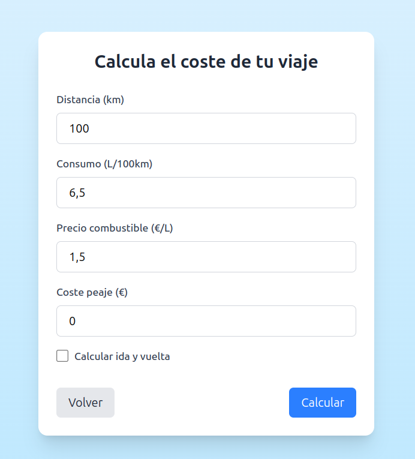

# 🚗 Travel Calculator

¡Bienvenido a **Travel Calculator**! Esta aplicación te ayuda a calcular el coste total de tus viajes en coche, incluyendo combustible, peajes y la opción de ida y vuelta. Todo esto con una interfaz moderna y fácil de usar. 🌟

---

## 🖼️ Capturas de Pantalla

### Pantalla Principal


### Calculadora


---

## 🚀 Características

- **Cálculo de costes**: Introduce la distancia, el consumo de tu coche, el precio del combustible y los peajes para obtener el coste total.
- **Modo ida y vuelta**: Calcula automáticamente el coste para viajes de ida y vuelta.
- **Animaciones suaves**: Transiciones y animaciones modernas para una experiencia de usuario agradable.
- **Diseño responsivo**: Compatible con dispositivos móviles y de escritorio.

---

## 🛠️ Tecnologías Utilizadas

- **[Vue 3](https://vuejs.org/)**: Framework de JavaScript para la interfaz de usuario.
- **[Vite](https://vitejs.dev/)**: Herramienta de desarrollo rápida y moderna.
- **[Tailwind CSS](https://tailwindcss.com/)**: Framework de CSS para un diseño elegante y responsivo.

---

## 📦 Instalación

Sigue estos pasos para ejecutar el proyecto en tu máquina local:

1. Clona este repositorio:
   ```bash
   git clone https://github.com/tu-usuario/travel-calculator.git
   cd travel-calculator

2. Instala las dependencias:
   ```bash
   npm install

3. Inicia el servidor de desarrollo:
   ```bash
   npm run dev

4. Abre tu navegador en http://localhost:5173

---

## 📄 Uso

1. Haz clic en Continuar en la pantalla de inicio.
2. Introduce los datos de tu viaje: distancia, consumo, precio del combustible y peajes.
3. Marca la casilla de Ida y vuelta si aplica.
4. Haz clic en Calcular para ver el coste total.

---

## 📝 Licencia

Este proyecto está bajo la licencia MIT. Consulta el archivo LICENSE para más detalles.

---

## 📧 Contacto
Si tienes preguntas o sugerencias, no dudes en contactarme:

Email: tomaslopezraigal@gmail.com
GitHub: tomasrl18

---

¡Gracias por usar Travel Calculator! 🚗✨